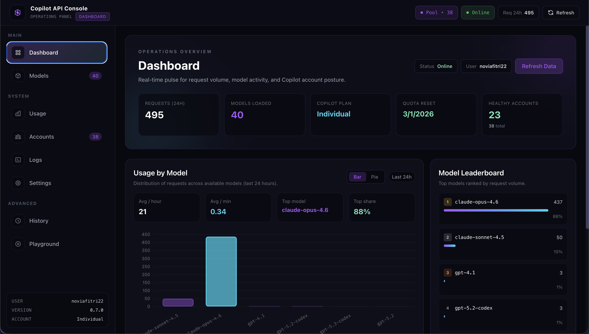
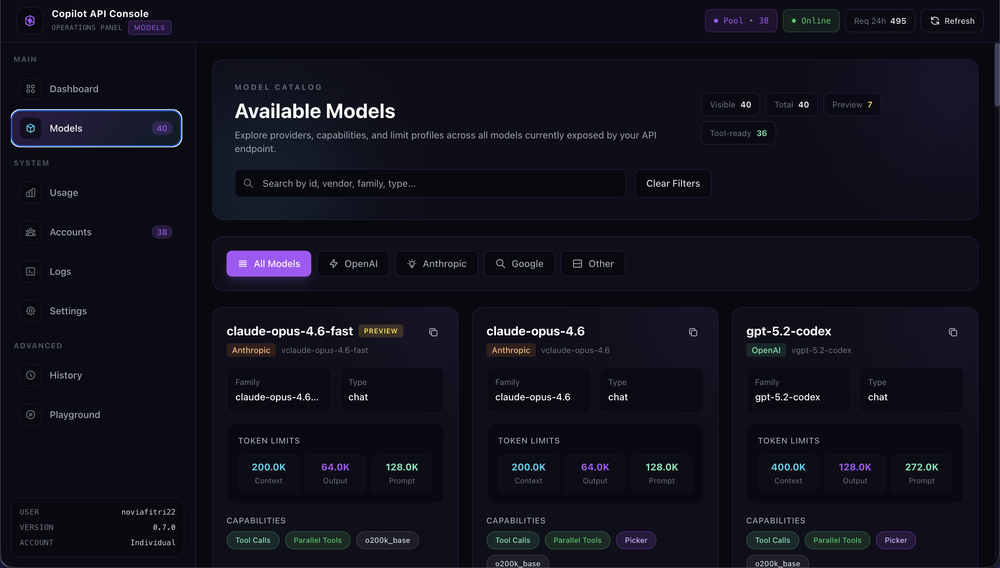
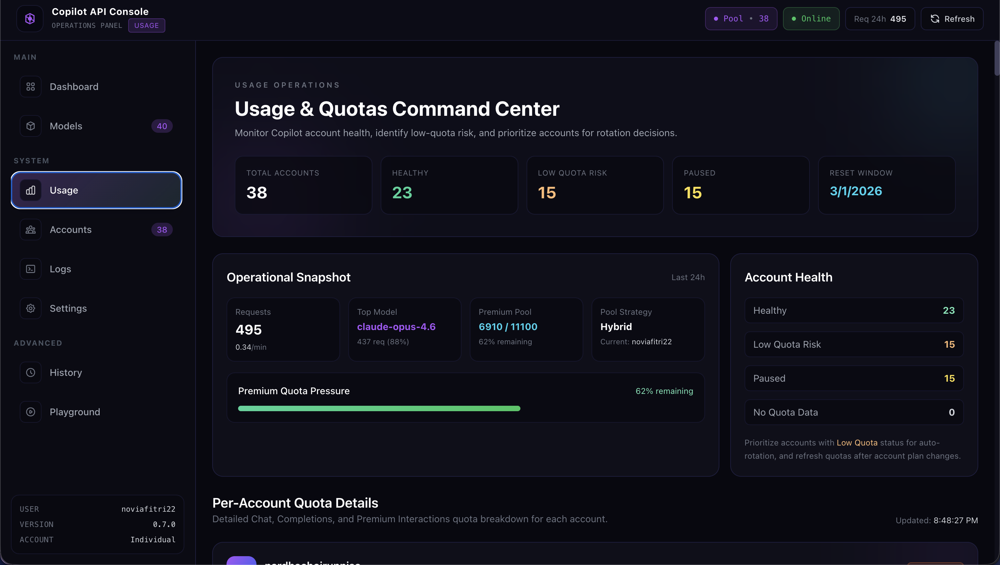
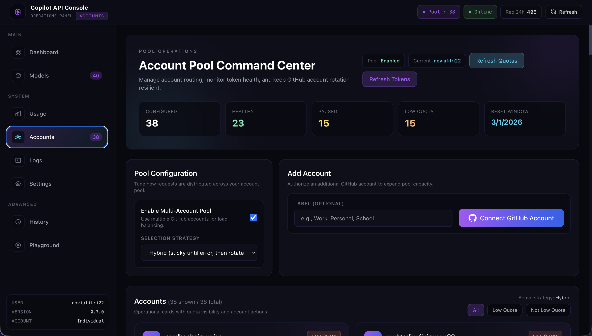
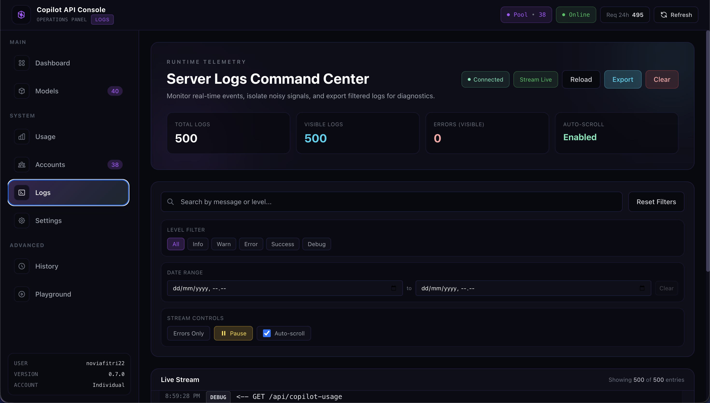
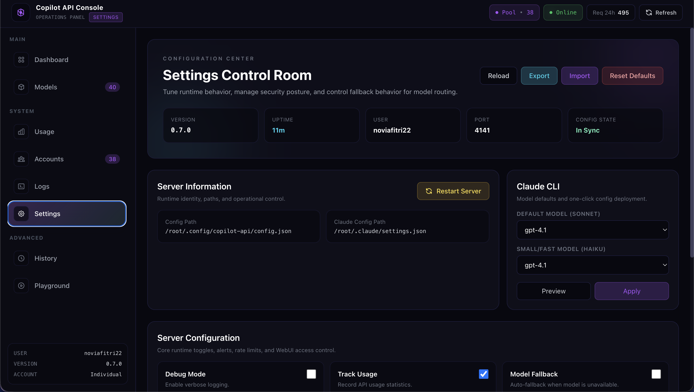
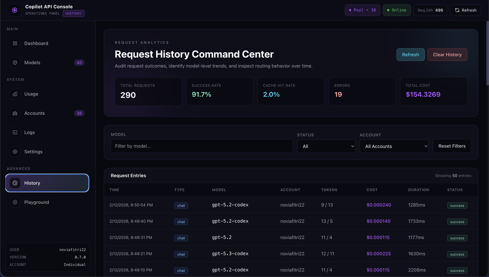
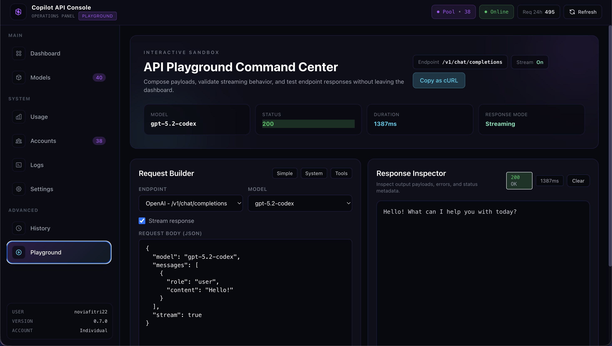

# Copilot API Proxy

> **⚠️ WARNING**
> This is a reverse-engineered proxy of GitHub Copilot API. It is not officially supported by GitHub and may break unexpectedly. Use at your own risk.

> **⚠️ GitHub Security Notice**
> Excessive automated or scripted use of Copilot (including rapid or bulk requests) may trigger GitHub's abuse-detection systems. You may receive a warning from GitHub Security, and further anomalous activity could result in temporary suspension of your Copilot access.
>
> Please review:
> - [GitHub Acceptable Use Policies](https://docs.github.com/site-policy/acceptable-use-policies/github-acceptable-use-policies#4-spam-and-inauthentic-activity-on-github)
> - [GitHub Copilot Terms](https://docs.github.com/site-policy/github-terms/github-terms-for-additional-products-and-features#github-copilot)

---

## Screenshots

### Dashboard


### Available Models


### Usage & Quotas 


### Manage Accounts


### Server Logs


### Settings Control


### Request History


### API Playground

---

## Overview

A reverse-engineered proxy server that transforms the GitHub Copilot API into **OpenAI-compatible** and **Anthropic-compatible** endpoints. This enables you to use GitHub Copilot with any tool that supports the OpenAI Chat Completions API or the Anthropic Messages API, including [Claude Code](https://docs.anthropic.com/en/docs/claude-code/overview).

---

## Features

### Core Features
| Feature | Description |
|---------|-------------|
| **OpenAI API Compatible** | Exposes `/v1/chat/completions`, `/v1/models`, `/v1/embeddings` endpoints |
| **Anthropic API Compatible** | Exposes `/v1/messages` and `/v1/messages/count_tokens` endpoints |
| **Streaming Support** | Full support for streaming responses (SSE) |
| **Multiple Account Types** | Supports Individual, Business, and Enterprise Copilot plans |

### Advanced Features
| Feature | Description |
|---------|-------------|
| **Multi-Account Pool** | Manage multiple GitHub accounts with automatic rotation strategies |
| **Request Caching** | LRU cache with configurable TTL to save quota |
| **Request Queue** | Concurrent request management with priority and limits |
| **Rate Limiting** | Configurable rate limits with wait/error modes |
| **Model Fallback** | Automatic fallback to alternative models when primary fails |
| **Cost Tracking** | Estimate and track costs based on token usage |
| **Webhook Notifications** | Send alerts to Discord, Slack, or custom webhooks |

### Management Features
| Feature | Description |
|---------|-------------|
| **WebUI Dashboard** | Web-based interface for monitoring and configuration |
| **Usage Monitoring** | Track quota usage with detailed statistics |
| **Request History** | View and filter past API requests |
| **Live Logs** | Real-time server logs via SSE |
| **Claude Code Integration** | One-command setup for Claude Code CLI |

---

## Prerequisites

- **Bun** >= 1.2.x
- **GitHub Account** with active Copilot subscription (Individual, Business, or Enterprise)

---

## Installation

```bash
# Clone the repository
git clone https://github.com/prassaaa/copilot-api.git
cd copilot-api

# Install dependencies
bun install

# Development mode
bun run dev

# Production mode
bun run start

# Authentication only
bun run auth

# Check usage/quota
bun run check-usage
```

---

## Commands

### `start` - Start the API Server

```bash
bun run start [options]
```

| Option | Alias | Default | Description |
|--------|-------|---------|-------------|
| `--port` | `-p` | `4141` | Port to listen on |
| `--verbose` | `-v` | `false` | Enable verbose logging |
| `--account-type` | `-a` | `individual` | Account type: `individual`, `business`, `enterprise` |
| `--manual` | - | `false` | Enable manual request approval |
| `--rate-limit` | `-r` | - | Rate limit in seconds between requests |
| `--wait` | `-w` | `false` | Wait instead of error when rate limited |
| `--github-token` | `-g` | - | Provide GitHub token directly |
| `--claude-code` | `-c` | `false` | Generate Claude Code launch command |
| `--show-token` | - | `false` | Display tokens on fetch/refresh |
| `--proxy-env` | - | `false` | Use proxy from environment variables |

### `auth` - Authenticate with GitHub

```bash
bun run auth [options]
```

| Option | Alias | Default | Description |
|--------|-------|---------|-------------|
| `--verbose` | `-v` | `false` | Enable verbose logging |
| `--show-token` | - | `false` | Show GitHub token on auth |

### `check-usage` - Check Copilot Usage

```bash
bun run check-usage
```

Displays current Copilot quota and usage statistics in the terminal.

### `debug` - Display Debug Information

```bash
bun run debug [options]
```

| Option | Default | Description |
|--------|---------|-------------|
| `--json` | `false` | Output debug info as JSON |

---

## API Endpoints

### OpenAI Compatible Endpoints

| Endpoint | Method | Description |
|----------|--------|-------------|
| `/v1/chat/completions` | `POST` | Create chat completion |
| `/chat/completions` | `POST` | Create chat completion (alias) |
| `/v1/models` | `GET` | List available models |
| `/models` | `GET` | List available models (alias) |
| `/v1/embeddings` | `POST` | Create embeddings |
| `/embeddings` | `POST` | Create embeddings (alias) |

### Anthropic Compatible Endpoints

| Endpoint | Method | Description |
|----------|--------|-------------|
| `/v1/messages` | `POST` | Create message (Anthropic format) |
| `/v1/messages/count_tokens` | `POST` | Count tokens for messages |

### Monitoring Endpoints

| Endpoint | Method | Description |
|----------|--------|-------------|
| `/usage` | `GET` | Get Copilot usage statistics |
| `/token` | `GET` | Get current Copilot token |
| `/account-limits` | `GET` | Get account rate limits |
| `/health` | `GET` | Simple health check |
| `/health/detailed` | `GET` | Detailed health status |

### WebUI API Endpoints

All WebUI endpoints are prefixed with `/api/` and may require authentication if password is configured.

| Endpoint | Method | Description |
|----------|--------|-------------|
| `/api/login` | `POST` | Authenticate to WebUI |
| `/api/logout` | `POST` | Clear session |
| `/api/auth-status` | `GET` | Check authentication status |
| `/api/status` | `GET` | Server status |
| `/api/models` | `GET` | Available models |
| `/api/copilot-usage` | `GET` | Copilot usage data |
| `/api/config` | `GET/POST` | Get or update configuration |
| `/api/accounts` | `GET/POST` | List or add accounts |
| `/api/accounts/:id` | `DELETE` | Remove account |
| `/api/accounts/refresh` | `POST` | Refresh account tokens |
| `/api/accounts/oauth/start` | `POST` | Start OAuth flow |
| `/api/accounts/oauth/complete` | `POST` | Complete OAuth flow |
| `/api/logs/stream` | `GET` | Stream server logs (SSE) |
| `/api/logs/recent` | `GET` | Get recent logs |

---

## Configuration

Configuration is stored in `~/.config/copilot-api/config.json`.

### Configuration Options

```json
{
  "port": 4141,
  "debug": false,
  "webuiPassword": "",

  "rateLimitSeconds": null,
  "rateLimitWait": false,

  "fallbackEnabled": false,
  "modelMapping": {},

  "trackUsage": true,
  "trackCost": true,

  "poolEnabled": false,
  "poolStrategy": "sticky",
  "poolAccounts": [],

  "queueEnabled": false,
  "queueMaxConcurrent": 3,
  "queueMaxSize": 100,
  "queueTimeout": 60000,

  "webhookEnabled": false,
  "webhookProvider": "discord",
  "webhookUrl": "",

  "cacheEnabled": true,
  "cacheMaxSize": 1000,
  "cacheTtlSeconds": 3600,

  "autoRotationEnabled": true
}
```

### Pool Strategies

| Strategy | Description |
|----------|-------------|
| `sticky` | Uses the same account until an error occurs |
| `round-robin` | Rotates through accounts sequentially |
| `quota-based` | Selects account with the most remaining quota |
| `hybrid` | Sticky with automatic rotation on errors |

### Environment Variables

| Variable | Description |
|----------|-------------|
| `PORT` | Server port |
| `DEBUG` | Enable debug mode |
| `WEBUI_PASSWORD` | WebUI password |
| `FALLBACK` | Enable model fallback |
| `GH_TOKEN` | GitHub token |
| `HTTP_PROXY` | HTTP proxy URL |
| `HTTPS_PROXY` | HTTPS proxy URL |
| `NO_PROXY` | Proxy bypass list |

---

## Claude Code Integration

### Method 1: Interactive Setup (Recommended)

```bash
bun run start --claude-code
```

This will:
1. Start the proxy server
2. Prompt you to select models
3. Copy the launch command to your clipboard
4. Paste and run in a new terminal to start Claude Code

### Method 2: Manual Configuration

Create `.claude/settings.json` in your project root:

```json
{
  "env": {
    "ANTHROPIC_BASE_URL": "http://localhost:4141",
    "ANTHROPIC_AUTH_TOKEN": "dummy",
    "ANTHROPIC_MODEL": "gpt-4.1",
    "ANTHROPIC_SMALL_FAST_MODEL": "gpt-4.1",
    "DISABLE_NON_ESSENTIAL_MODEL_CALLS": "1",
    "CLAUDE_CODE_DISABLE_NONESSENTIAL_TRAFFIC": "1"
  },
  "permissions": {
    "deny": ["WebSearch"]
  }
}
```

---

## WebUI Dashboard

After starting the server, access the WebUI at `http://localhost:4141`.

### Dashboard Features

- **Real-time Quota Visualization** - Monitor your Copilot usage
- **Live Server Logs** - View logs in real-time via SSE
- **Account Pool Management** - Add/remove GitHub accounts
- **OAuth Device Flow** - Easy account addition via browser
- **Configuration Editor** - Modify settings without restart
- **Request History** - View and filter past requests
- **Cost Analytics** - Track estimated costs by model
- **Queue Status** - Monitor request queue

---

## Usage Examples

### Basic Usage

```bash
# Start with default settings
bun run start

# Start with custom port
bun run start --port 8080

# Start with verbose logging
bun run start --verbose
```

### With Rate Limiting

```bash
# 30 seconds between requests, error on limit
bun run start --rate-limit 30

# 30 seconds between requests, wait instead of error
bun run start --rate-limit 30 --wait
```

### Business/Enterprise Account

```bash
# Business account
bun run start --account-type business

# Enterprise account
bun run start --account-type enterprise
```

### With Proxy

```bash
# Set proxy environment variables
export HTTP_PROXY=http://proxy.example.com:8080
export HTTPS_PROXY=http://proxy.example.com:8080

# Start with proxy support
bun run start --proxy-env
```

### API Request Examples

#### OpenAI Format

```bash
curl http://localhost:4141/v1/chat/completions \
  -H "Content-Type: application/json" \
  -d '{
    "model": "gpt-4.1",
    "messages": [
      {"role": "user", "content": "Hello!"}
    ]
  }'
```

#### Anthropic Format

```bash
curl http://localhost:4141/v1/messages \
  -H "Content-Type: application/json" \
  -H "x-api-key: dummy" \
  -H "anthropic-version: 2023-06-01" \
  -d '{
    "model": "claude-sonnet-4-20250514",
    "max_tokens": 1024,
    "messages": [
      {"role": "user", "content": "Hello!"}
    ]
  }'
```

---

## Project Structure

```
copilot-api/
├── src/
│   ├── main.ts              # CLI entry point
│   ├── server.ts            # Hono server setup
│   ├── start.ts             # Server startup orchestration
│   ├── auth.ts              # GitHub OAuth authentication
│   ├── check-usage.ts       # Usage checking command
│   ├── debug.ts             # Debug command
│   ├── lib/                 # Core libraries
│   │   ├── token.ts         # Token management
│   │   ├── config.ts        # Configuration management
│   │   ├── account-pool.ts  # Multi-account rotation
│   │   ├── request-cache.ts # Request caching
│   │   ├── request-queue.ts # Request queue management
│   │   ├── cost-calculator.ts # Cost estimation
│   │   ├── fallback.ts      # Model fallback logic
│   │   └── ...
│   ├── routes/              # API route handlers
│   │   ├── chat-completions.ts
│   │   ├── embeddings.ts
│   │   ├── models.ts
│   │   └── messages/        # Anthropic format handlers
│   ├── services/            # External service integrations
│   │   └── copilot.ts       # GitHub Copilot API client
│   └── webui/               # WebUI API handlers
├── public/                  # Static assets (WebUI)
├── tests/                   # Test files
└── package.json             # Dependencies
```

---

## Tech Stack

| Component | Technology |
|-----------|------------|
| Runtime | [Bun](https://bun.sh) |
| Web Framework | [Hono](https://hono.dev) |
| CLI Framework | [Citty](https://github.com/unjs/citty) |
| Validation | [Zod](https://zod.dev) |
| Build Tool | [tsdown](https://github.com/nicepkg/tsdown) |
| Logging | [Consola](https://github.com/unjs/consola) |
| Tokenizer | [gpt-tokenizer](https://github.com/niieani/gpt-tokenizer) |

---

## Data Storage

All data is stored locally in the user's home directory:

| Path | Description |
|------|-------------|
| `~/.config/copilot-api/config.json` | Server configuration |
| `~/.local/share/copilot-api/github-token` | GitHub access token |
| `~/.local/share/copilot-api/account-pool.json` | Account pool state |
| `~/.local/share/copilot-api/request-cache.json` | Request cache |
| `~/.local/share/copilot-api/request-history.json` | Request history |
| `~/.local/share/copilot-api/cost-history.json` | Cost tracking data |

---

## Troubleshooting

### Authentication Issues

```bash
# Re-authenticate
bun run auth

# Check debug info
bun run debug
```

### Rate Limiting

If you're hitting rate limits:
1. Use `--rate-limit` flag to enforce delays
2. Enable request caching in config
3. Use multi-account pool for load distribution

### Connection Issues

```bash
# Test health endpoint
curl http://localhost:4141/health

# Check detailed health
curl http://localhost:4141/health/detailed
```

---

## Contributing

1. Fork the repository
2. Create your feature branch (`git checkout -b feature/amazing-feature`)
3. Commit your changes (`git commit -m 'Add some amazing feature'`)
4. Push to the branch (`git push origin feature/amazing-feature`)
5. Open a Pull Request

---

## License

This project is licensed under the MIT License - see the [LICENSE](LICENSE) file for details.

---

## Acknowledgements

This project is a rebuild/fork of the original [copilot-api](https://github.com/ericc-ch/copilot-api) created by [Erick Christian](https://github.com/ericc-ch).

Special thanks to him for creating the original project and making it open source. His work laid the foundation for this project.

---

## Disclaimer

This project is not affiliated with, endorsed by, or sponsored by GitHub or Microsoft. GitHub Copilot is a trademark of GitHub, Inc. Use this software responsibly and in accordance with GitHub's terms of service.
